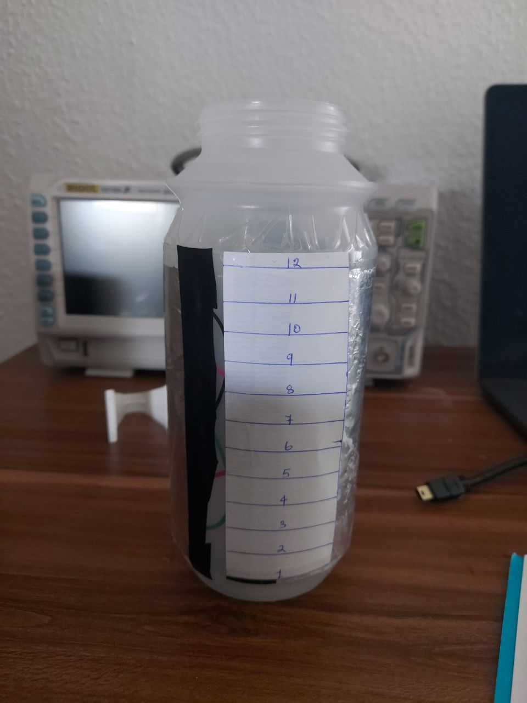

## Walter: The Water Butler

### The Science of Walter

The primary design goal of this project is to use a non-intrusive sensor to avoid contamination of potable water. Therefore, we use a DIY capacitance based sensor and to keep it simple we go with parallel plate design. The two plates are made of aluminium foil and are fixed to the outside wall of the bottle. To create a mathematical model let's start with the famous capacitance equation shown below.


Since the combined dielectric constant would be a function of the height of the water we can simply measure the capacitance and deduce the height of the water. Easy-peazy lemon-squeazy, just that it is not that easy.

The first complexity is that we cannot model it as a parallel plate capacitor. Simply because the plates are not parallel, in other words, the distance between the plates is not constant it varies along the shorter edge of the plate.


The second complexity is that the electrical conductivity of water also has a role to play in the increase of capacitance. Potable water even though being "bad" is a conductor (unless you are drinking distilled water). Due to this the water acts like a "bad" conducting metal slab between our capacitor. Due to this the effective capacitor circuit is equivalent to two capacitors connected in series with a high reistance between them. Watch [this](https://www.youtube.com/watch?v=ygADYZEBmtc) video to know why.


Therefore, in addition to factoring in a "varying" `d` we would also have to factor in the effect of water as a bad conductor(the electrical conductivity) along with the effect of dielectric constant. One cannot get tangled into the physics of things while playing the role of a hobbyist (one can actually, but one is planning not to. XD). So we just move forward by considering it to be a blackbox and use analytical methods to find the relation between the capacitance and the level of water.

### The Analytics of Walter

#### Quick Setup
```bash
virtualenv venv
source venv/bin/activate
pip install -r requirements.txt
```

#### Collecting Datapoints

```bash
python3 create_dataset.py
```

This python script continuously reads the reading coming from the Arduino Nano (sensor value). It creates one datapoint for each value in the format shown below

```json
{
  "index": 0,
  "val": 742,
  "touch": false,
  "level": 0,
  "filling": false
}
```

* `index` is automatically incremented for every new datapoint.
* `val` represents the sensor value.
* `touch` flags a particular datapoint to the action of touching the sensor (since touching the sensor spikes the capacitance value).
  * To flag a datapoint as touch you simply have to keep the `e` key pressed while touching the sensor. Once the press is realesed the flag is turned off.
* `filling` flags a particular datapoint to the action of filling.
  * one can toggle the `filling` flag for all consecutive datapoints using the `a` key. Therefore all datapoints until the `a` key is pressed again will be marked as filling.
* `level` marks the level of water for that datapoint.
  * it can be incremented using the `w` key and decremented using the `s` key

***A not so novel method of collecting datapoints:***

The reasoning behind these flags is that we can only mark a certain number of levels on the water bottle. Since these levels are discrete we need to filter out datapoints created when we our filling the bottle to the next level or emptying it to the below level. This is done using the `filling` flag. Since while filling the bottle we will also be touching the sensor we need to filter out these value as well (unless we want to study or experiment with touch sensing. see later section.). This is done using the `touch` tag. The `level` tag is simply incremented or decremented **before** we turn **off** the `filling` flag. This is to ensure that no datapoint is marked for the wrong level.

A better way to control the datapoints would be to specify when we should collect the datapoints instead of continuously collecting them. Yet to be implemented.

#### Pre-existing datasets

*TODO*

#### Viewing the data

*TODO*

```bash
python3 statistics.py datasets/<name_of_json_dataset>
```

Example:
```bash
python3 statistics.py datasets/linear_incremental_filling.json
```

### Circuit Diagram


### Images



#### TODO:
* [x] Add License file
* [ ] README Documentation
  * [ ] Datasets
  * [x] Data extraction process
  * [ ] Statistics
  * [x] The science of walter
* [ ] Calibration Sequence
  * [ ] function for computing the line equation
  * [ ] triggers for interacting with the user
* [ ] Further Experiments
  * [x] moving average filter (first tried with pythons scripts (`python3 statistics.py <dataset_path> -m`) and then updated the arduino code `Walter_Filtered`)
  * [ ] Kalman Filtering
  * [ ] Touch sensing datasets
* [ ] Hardware Improvements
  * [ ] 3D printed case
  * [ ] LEDs & Buttons for eliminating interaction via python scripts
  * [ ] Aluminium or Copper Tape electrodes
  * [ ] Temperature sensor for temperature based calibration
  * [ ] Custom Board with NFC to elimate communication using python scripts
  * [ ] Power supply design
