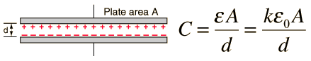
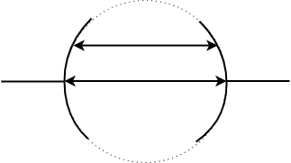
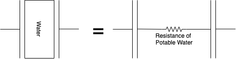
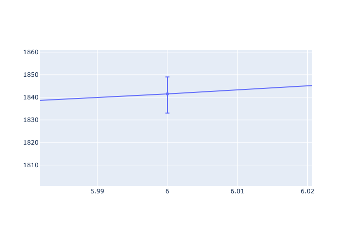
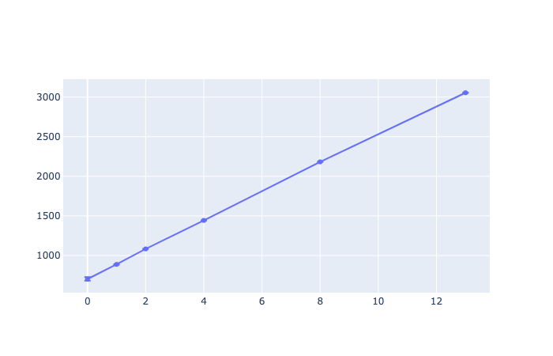
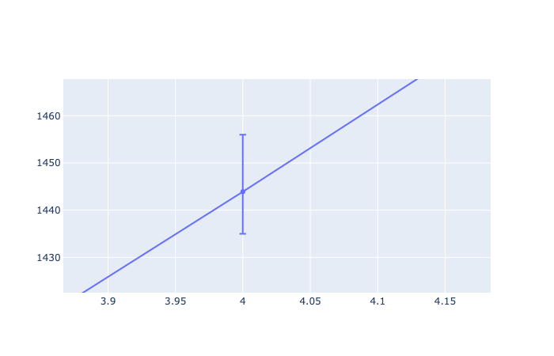
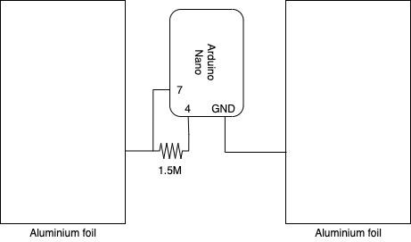
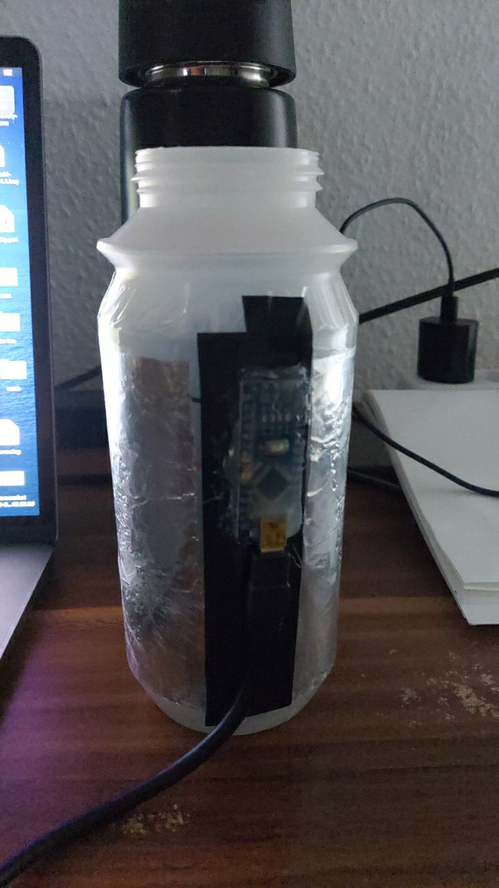

## Walter: The Water Butler

### The Science of Walter

The primary design goal of this project is to use a non-intrusive sensor to avoid contamination of potable water. Therefore, we use a DIY capacitance based sensor and to keep it simple we go with parallel plate design. The two plates are made of aluminium foil and are fixed to the outside wall of the bottle. To create a mathematical model let's start with the famous capacitance equation shown below.



Since the combined dielectric constant would be a function of the height of the water we can simply measure the capacitance and deduce the height of the water. Easy-peazy lemon-squeazy, just that it is not that easy.

The first complexity is that we cannot model it as a parallel plate capacitor. Simply because the plates are not parallel, in other words, the distance between the plates is not constant it varies along the shorter edge of the plate.



The second complexity is that the electrical conductivity of water also has a role to play in the increase of capacitance. Potable water even though being "bad" is a conductor (unless you are drinking distilled water). Due to this the water acts like a "bad" conducting metal slab between our capacitor. Due to this the effective capacitor circuit is equivalent to two capacitors connected in series with a high reistance between them. Watch [this](https://www.youtube.com/watch?v=ygADYZEBmtc) video to know why.



Therefore, in addition to factoring in a "varying" `d` we would also have to factor in the effect of water as a bad conductor(the electrical conductivity) along with the effect of dielectric constant. One cannot get tangled into the physics of things while playing the role of a hobbyist (one can actually, but one is planning not to. XD). So we just move forward by considering it to be a blackbox and use analytical methods to find the relation between the capacitance and the level of water.

### The Analytics of Walter

#### Quick Setup
```bash
virtualenv venv
source venv/bin/activate
pip install -r requirements.txt
```

#### Collecting Datapoints


```bash
python3 create_dataset.py
```

This python script runs a infinite loop while asking the user two questions in every iteration fo the loop.

1. "Enter number of datapoints to collect(q/Q - quit): " - this is where the user can specify the number of datapoints to be collected or type in `q` or `Q` to quit.
2. "Enter the level of water: " - The water level entered here will be used for all the datapoints that were specified in the question above.

Each datapoint is stored as JSON string as shown below and each dataset is a `List` of datapoints.

```json
{
  "index": 0,
  "val": 742,
  "level": 0,
}
```

* `index` (*self-explanatory*)automatically incremented for every new datapoint.
* `val` represents the sensor value.
* `level` marks the level of water.

This repository has two pre-existing datasets,
1. `linear_filling` - datapoints are collected starting from `level 0` and linearly incrementing thereafter upto `level 13`.
2. `exponential_filling` datapoints are collected starting from `level 0` and exponentially incrementing thereafter upto level 13 i.e. at 0, 1, 2, 4, 8, 13

#### Analyzing the data

```bash
python3 statistics.py datasets/<name_of_json_dataset>
```

Linear Filling:

*zoomed in view of `level 6` error bar*


Exponential Filling:

*zoomed in view of `level 4` error bar*


We can deduce the following conclusions of the experiment
1. The sensor value is more or less **linearly** dependent on the level of water.
    * Flattening/breaking of the line after `level 12` of water in the `linear_filling` plot is because level 13 is above the plate area of the capacitor and hence has no or minimal effect on the capacitance.
2. The error in the values is max at +/- 10. This is **super awesome** considering we had to write only a couple of lines of code and solder one resistor to make the sensor.

Further questions to ponder upon:
* Is the linear realtionship because of the **uniform** nature of the cylindrical bottle?
* What if the shape of the bottle is not uniform across the cross section of the plates
* Since the relationship is linear can we simply collect two datapoints and compute the line equation? (reaping the benefits of continuity of the realtionship)

### Circuit Diagram


### Images



#### TODO:
* [x] Add License file
* [ ] README Documentation
  * [x] Datasets
  * [x] Data extraction process
  * [x] Statistics
  * [x] The science of walter
  * [ ] Adding "Advanced: The filtering of walter" section
  * [ ] Adding "Advanced: The touchyness of walter" section
* [ ] Calibration Sequence
  * [ ] function for computing the line equation
  * [ ] triggers for interacting with the user
* [ ] Further Experiments
  * [x] moving average filter (first tried with pythons scripts (`python3 statistics.py <dataset_path> -m`) and then updated the arduino code `Walter_Filtered`)
  * [ ] Kalman Filtering
  * [ ] Touch sensing datasets
* [ ] Hardware Improvements
  * [ ] 3D printed case
  * [ ] LEDs & Buttons for eliminating interaction via python scripts
  * [ ] Aluminium or Copper Tape electrodes
  * [ ] Temperature sensor for temperature based calibration
  * [ ] Using NRF52840 Dongle to eliminate communication using python scripts
  * [ ] Power supply design
